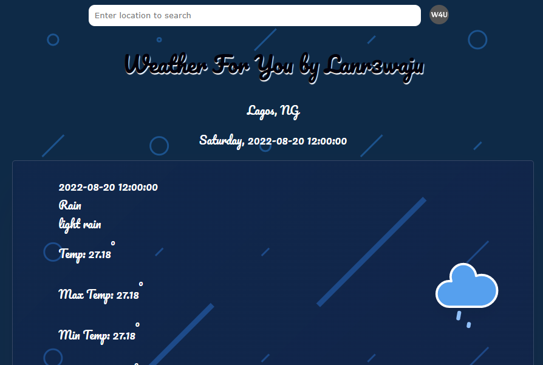

# Weather For You

> This is a weather app that displays the weather forecast for 4 days.



Additional description about the project and its features.

## Built With

- HTML, CSS, JavaScript
- OpenWeatherMap Api, Geo-location Api, Geo-coder Api,
- Fetch API, Async, Await.

## Live Demo

[Live Demo Link](https://weather-4-you.netlify.app/)

### Development (Running locally)

- Clone the project

```bash
git clone https://github.com/Lanr3waju/weather-for-you.git

```

- Install Dependencies

```bash
npm install
```

To run StyleLint by itself, you may run the lint task:

```bash
npm run lint:check
```

Or to automatically fix issues found (where possible):

```bash
npm run lint
```

You can also check against Prettier:

```bash
npm run format:check
```

and to have it actually fix (to the best of its ability) any format issues, run:

```bash
npm run format
```

You can also check against HTML Validator:

```bash
npm run html-validator
```

## Style Guides

- [CSS Style Guide](http://udacity.github.io/frontend-nanodegree-styleguide/css.html)
- [HTML Style Guide](http://udacity.github.io/frontend-nanodegree-styleguide/index.html)
- [JavaScript Style Guide](http://udacity.github.io/frontend-nanodegree-styleguide/javascript.html)
- [Git Style Guide](https://udacity.github.io/git-styleguide/)

## 👤 Author

- Github: [@author](https://github.com/lanr3waju)
- Twitter: [@author](https://twitter.com/abass-wasi)
- Linkedin: [@author](https://www.linkedin.com/in/abass-abdul-wasi-53883422a/)

## 🤝 Contributing

Contributions, issues and feature requests are welcome!

Feel free to check the [issues page](../../issues).

## Show your support

Give a ⭐️ if you like this project!

## Acknowledgments

- [openWeatherMap](https://openweathermap.org/)
- [openCage Geocoding Api](https://opencagedata.com/api)
- [Bgjar SVG ](https://bgjar.com/)
- [amCharts Weather Icons](https://www.amcharts.com/)
- [SVG Backgrounds](https://www.svgbackgrounds.com/)

## 📝 License

[MIT licensed](./LICENSE).
